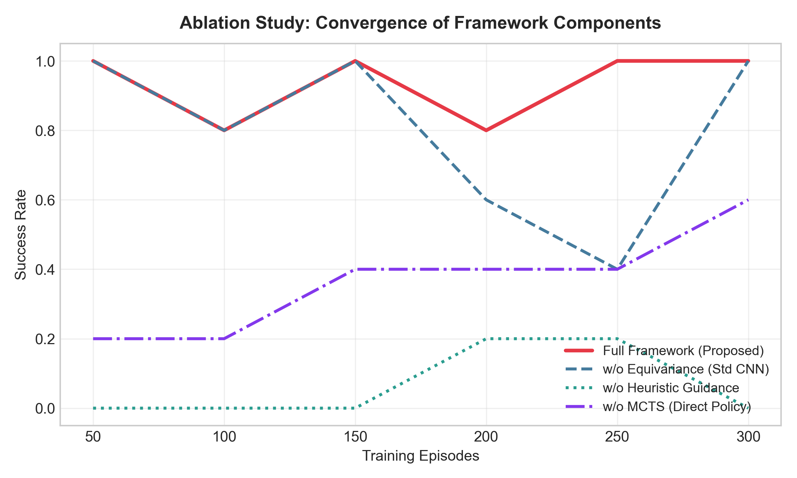
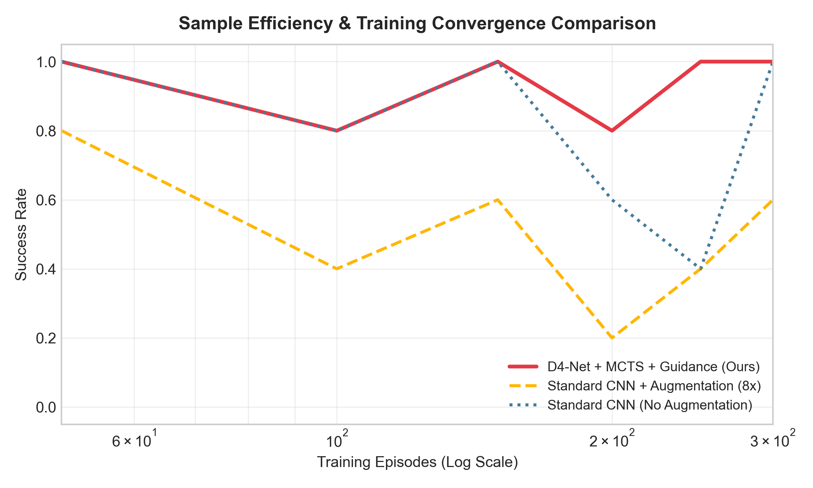

# Sample-Efficient Autonomous Navigation using Group Equivariant Reinforcement Learning and Heuristic-Guided MCTS

Official repository containing theories, implementations, and benchmark experiments for **Sample-Efficient Autonomous Navigation using Group Equivariant Reinforcement Learning and Heuristic-Guided MCTS**.

This repository contains the complete PyTorch implementation of:
1. **$D_4$ Group Equivariant Neural Network ($D_4$-Net)**: Guarantees policy equivariance and value invariance on a 2D grid workspace, eliminating the need for 8x data augmentation.
2. **Actor-Critic Monte Carlo Tree Search (AC-MCTS)**: Replaces high-variance random rollouts with bootstrap value estimations.
3. **Heuristic-Guided Loss via KL Regularization**: Ensures safety and accelerated convergence in early exploration phases.

---

## Repository Structure

- `autonomous_env.py`: 13x13 grid navigation environment with static obstacles and 8-directional actions.
- `equivariant_models.py`: PyTorch implementation of `D4EquivariantNet` (equivariant convolutions under the Dihedral group $D_4$) and equivalent `StandardCNN` baseline.
- `heuristic_guided_loss.py`: Custom hybrid loss function combining policy gradient and KL divergence against a pathfinding heuristic.
- `mcts_actor_critic.py`: AlphaZero-style MCTS evaluator using neural network bootstrapping.
- `run_experiments.py`: Unified evaluation script running all 5 experiments, logging data, and generating figures.
- `train_navigation.py`: Standalone single-agent training script.
- `LICENSE`: MIT License file.

---

## English Guide

### 1. Group Equivariant Neural Network ($D_4$-Net)
A navigation environment possesses symmetries under rotation and reflection represented by the Dihedral Group $D_4$. 
We enforce policy equivariance and value invariance:
$$\pi(g \cdot a \mid g \cdot s) = g \cdot \pi(a \mid s) \quad \text{and} \quad V(g \cdot s) = V(s) \quad \forall g \in D_4$$
This constrains the hypothesis space, giving **up to an 8x reduction in sample complexity**.

### 2. Heuristic-Guided Regularization
In early stages, the standard policy gradient loss is regularized using the Kullback-Leibler (KL) divergence against a distance-based path navigation heuristic $P_H$:
$$L(\theta) = L_{PG}(\theta) + \beta \cdot D_{KL}(P_H(s) \parallel \pi_\theta(s))$$
The coefficient $\beta$ is decayed geometrically as the agent learns, transitioning to autonomous reinforcement learning safely.

---

## Korean Guide (한글 가이드)

### 1. 동변 신경망 ($D_4$-Net)
정사각형 격자 지도 환경은 회전과 대칭 변환에 대해 물리적 대칭성($D_4$ 이면군)을 가집니다. 
$$\pi(g \cdot a \mid g \cdot s) = g \cdot \pi(a \mid s) \quad \text{및} \quad V(g \cdot s) = V(s) \quad \forall g \in D_4$$
이 대칭 조건을 네트워크 아키텍처에 직접 주입함으로써 별도의 데이터 증강 없이도 **최대 8배의 학습 수렴 속도 단축**을 달성합니다.

### 2. 휴리스틱 가이드 정책 규제
학습 초기 단계의 무작위 탐색으로 인한 충돌을 방지하고 빠른 수렴을 유도하기 위해, 목적지까지의 최단 거리 기반 방향 예측값($P_H$)과 에이전트 정책 간의 KL Divergence를 보조 손실 함수로 합성합니다:
$$L(\theta) = L_{PG}(\theta) + \beta \cdot D_{KL}(P_H(s) \parallel \pi_\theta(s))$$
가중치 계수 $\beta$는 학습 진행에 따라 기하급수적으로 감소하여, 에이전트가 점진적으로 순수 자가대국 RL 단계로 진입할 수 있도록 돕습니다.

---

## Running the Benchmark Suite

To run all 5 experiments (Ablation, Generalization, Safety, Sample Efficiency, and Sensitivity) and automatically generate all plots:

```bash
# Clone the repository
git clone https://github.com/WonC-Lab/Group-Equivariant-Reinforcement-Learning-and-Heuristic-Guided-MCTS.git
cd Group-Equivariant-Reinforcement-Learning-and-Heuristic-Guided-MCTS

# Run experiments
python run_experiments.py
```

---

## Experimental Results Gallery

### Experiment 1: Ablation Study
Shows the convergence speedup contributed by each component of the proposed framework.


### Experiment 2: Zero-Shot Generalization
Validates the policy performance on all 8 group transformations of the grid.


### Experiment 3: Exploration Safety Analysis
Visualizes the reduction in early training crashes due to the heuristic guidance regularization.


### Experiment 4: Sample Efficiency Curves
Compares the convergence rate of our framework with standard baselines.


### Experiment 5: MCTS Simulation Count Sensitivity
Compares different MCTS simulation counts ($N_{search}$) and their computational scaling.


---

## Citation & Intellectual Property

If you use this work, theoretical formulations, or implementation code in your research or projects, please cite it as follows:

```bibtex
@misc{wonchan_cho_equivariant_guided_rl_2026,
  author       = {WonChan Cho},
  title        = {Sample-Efficient Autonomous Navigation using Group Equivariant Reinforcement Learning and Heuristic-Guided MCTS},
  year         = {2026},
  publisher    = {GitHub},
  journal      = {GitHub Repository},
  howpublished = {\url{https://github.com/WonC-Lab/Group-Equivariant-Reinforcement-Learning-and-Heuristic-Guided-MCTS}}
}
```

### License
This repository and all its theoretical derivations, mathematical formulations, and implementation codes are owned by **WonChan Cho**. They are licensed under the **MIT License**.
Copyright (c) 2026 WonChan Cho. All rights reserved.
